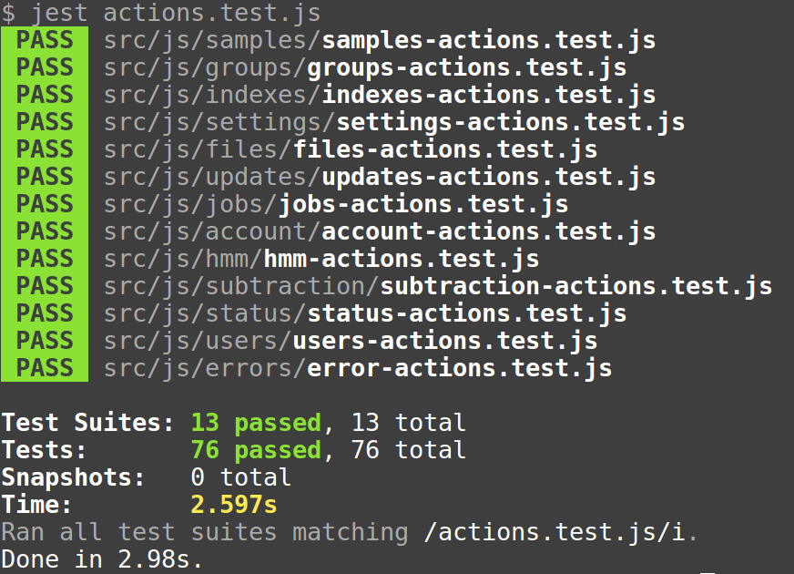
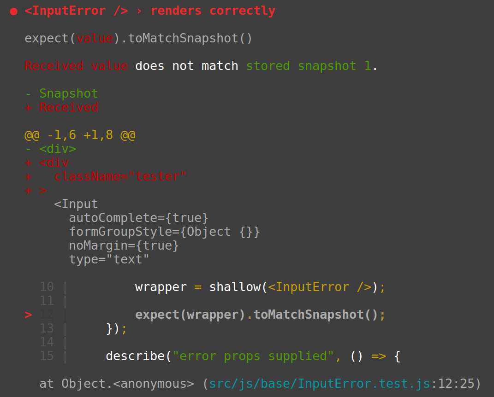
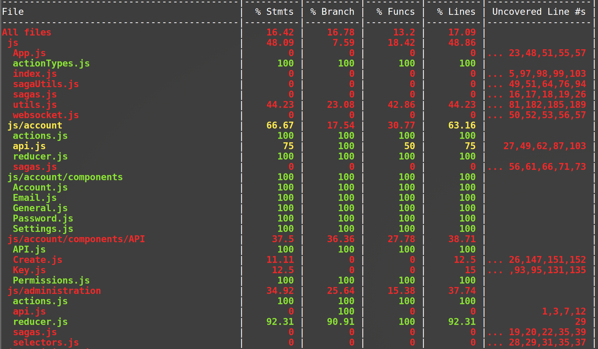

Testing for the client side of Virtool involves writing tests for [React](https://reactjs.org/) components, modules that
use [Redux](https://redux.js.org/), and [Redux-Saga](https://redux-saga.js.org/), and the [Virtool API](/docs/api).

We use [Jest](https://jestjs.io/) and [Enzyme](https://airbnb.io/enzyme/) for testing.

# Jest

Jest is developed by Facebook and the natural choice for testing React applications.

Testing dependencies, scripts, and Jest configuration settings can be found in the `package.json` file located in the `virtool/client` directory.
Configuration and global variables used by tests are declared in a file called `setupTest.js` located under `virtool/client/src/tests`.
Virtool already has Jest configured so there is no need for installation or configuration, however, additional configuration can be done by modifying these two files.

You can also specify [Jest's configuration options](https://facebook.github.io/jest/docs/en/cli.html) directly through the CLI. Virtool runs Jest via `npm test`, therefore jest command line arguments can also be applied to this command to be passed to the `jest` command line runner.

## 1. Testing

Jest acts as the test runner to execute test files through the command line, and logs the results to the terminal for inspection.
All tests can be run as follows:

```shell
cd virtool/client
npm test
```

To run a specific or a subset of tests (for example, all tests that contain the string `actions.test.js`):

```shell
npm test actions.test.js
```

The output should resemble the following:



Jest can automatically find test files to run if they are kept in a dedicated `\_\_tests\_\_` directory, or anywhere else if the files include a `.test.js` extension.

Jest is also a testing platform with a diverse API to allow you to write tests without the need for external plugins. Tests generally take the form of the following:

`virtool/client/src/js/errors/error-actions.test.js`

```javascript
import { clearError } from "./actions";
import { CLEAR_ERROR } from "../actionTypes";

describe("Errors Action Creators", () => {
  it("should create an action to clear specific error", () => {
    const error = "TARGET_ERROR";
    const result = clearError(error);
    const expected = { type: CLEAR_ERROR, error };

    expect(result).toEqual(expected);
  });
});
```

The `describe()` block denotes a test suite for a particular unit under test, which can contain multiple individual tests contained in `it()` blocks that exercise particular aspects of the corresponding code.

This test corresponds and resides next to the implementation file:

`virtool/client/src/js/errors/actions.js`

```javascript
import { CLEAR_ERROR } from "../actionTypes";

export const clearError = error => ({
  type: CLEAR_ERROR,
  error
});
```

## 2. Snapshot Testing

Jest also comes with a feature called [Snapshot Testing](https://facebook.github.io/jest/docs/en/snapshot-testing.html). Snapshot testing lends itself well to testing React components since it can be used to capture rendered outputs for comparison across code changes. This simplifies output testing and regression testing as any changes across snapshots will result in test failure and a diff report to the command line.



A dedicated directory called `__snapshots__` is generated within the parent directory that houses tests that execute snapshot matching. There can be multiple `__snapshots__` directories within the different project folders, each corresponding to test files inside that specific directory.

Snapshot failure can be resolved by fixing regression errors in the implementation code, or by updating the snapshot to reflect the newest version of the correct output.

Updating snapshots can be done by specifying the `-u` argument to the test command:

```shell
npm test Sample.test.js -u
```

Virtool uses Enzyme to render components, and the `enzyme-to-json` library to parse snapshots into an easily readable file.

`Sample.test.js.snap`

```markdown
// Jest Snapshot v1, https://goo.gl/fbAQLP

exports[`Example confirmation <Button />`] = `
<Button
bsStyle="danger"
icon="checkmark"
pullRight={false}
tipPlacement="top"

> Confirm
> </Button>
> `;
```

which corresponds to the implementation's `render()` output of `Sample.js`.

```jsx
  render () {
    return (
      <Button bsStyle="danger" icon="checkmark" onClick={onConfirm}>
          Confirm
      </Button>
    );
  }
```


Since snapshot files are used alongside testing, they should be committed with test files to Virtool's github repository.


## 3. Coverage Report

Jest also has built in coverage reporting that collects information from tested and untested files from the entire `virtool/client/src` directory.

Code coverage reports can be generated by running the following command:

```shell
npm test:coverage
```

Which runs all tests and displays a summary of code coverage metrics on the command line, similar to the following:



Coverage details for each file is stored in a dedicated directory that is generated after the first `npm test:coverage` command, and can be found under `virtool/client/coverage`. This directory will have subdirectories that reflect the directory tree of the codebase under test, with each file's coverage report saved with an `.html` extension and viewable in the browser.


The coverage directory and coverage files are **not** committed to repositories.


## Enzyme

[Enzyme](http://airbnb.io/enzyme/) is a JavaScript testing utility developed specifically for React whose [API](http://airbnb.io/enzyme/docs/api/) allows for rendering React components and asserting, manipulating, and traversing their output.

Enzyme is already installed and configured to work, with [shallow rendering](http://airbnb.io/enzyme/docs/api/shallow.html), [full DOM rendering](http://airbnb.io/enzyme/docs/api/mount.html), and [static rendering](http://airbnb.io/enzyme/docs/api/render.html) functions declared as globals in the `setupTest.js` file.

Enzyme is primarily used to render React components and simulate events.

```jsx
it("Enzyme example", () => {
  const props = { color: "blue", size: "30px" };
  const wrapper = shallow(<Sample {...props} />);

  expect(
    wrapper.contains(
      <div color="blue" width="30px">
        Sample
      </div>
    )
  ).toBe(true);
});
```


