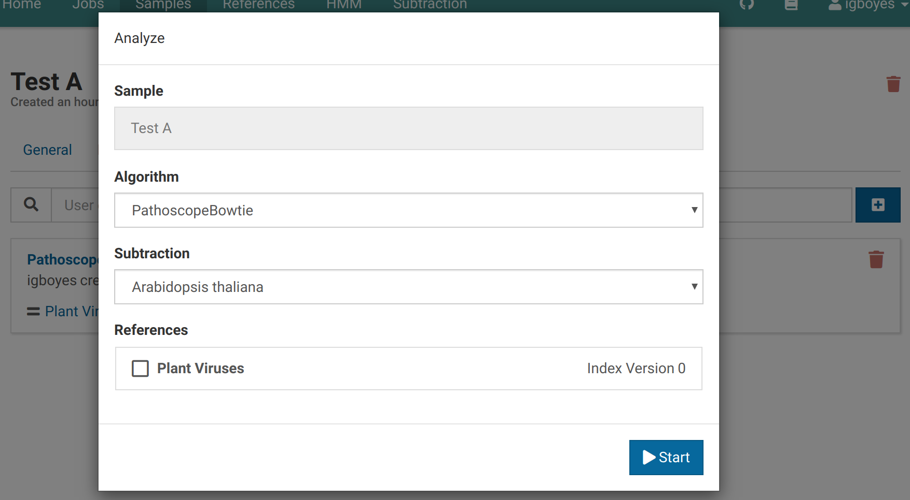
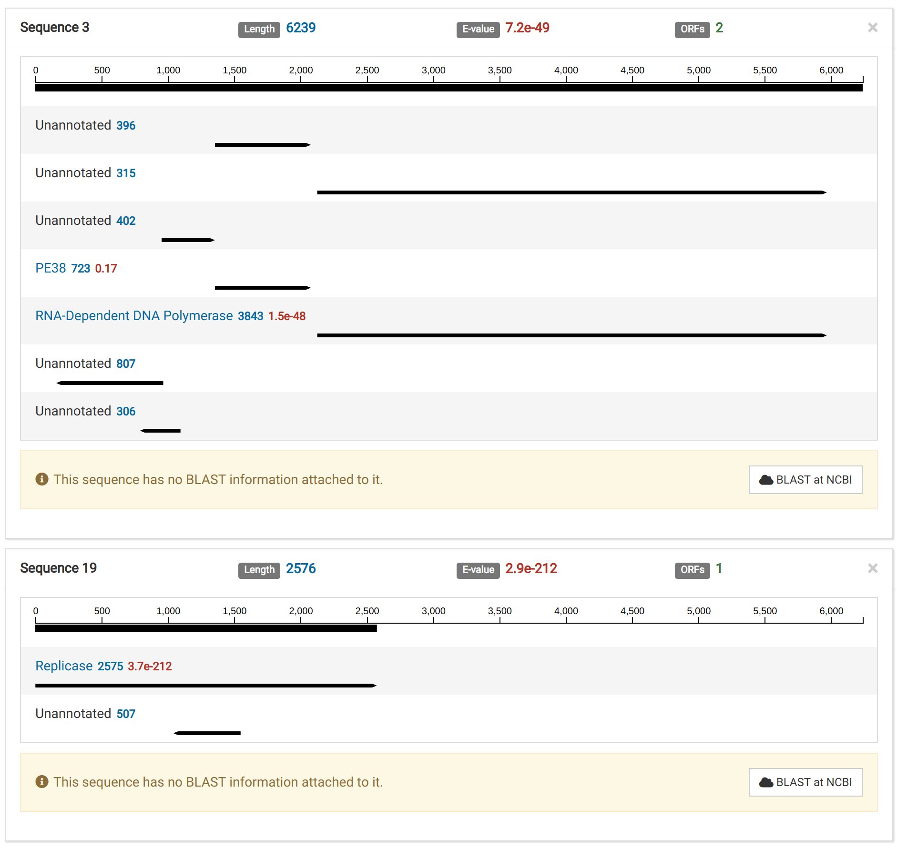

This tutorial assumes you have already [created a sample](/docs/manual/tut_sample/), [created and built a reference](/docs/manual/tut_reference/), [created a subtraction](/docs/manual/tut_subtraction/), and [installed HMM profiles and annotations](/docs/manual/tut_hmms/). You will use these data sources to run a bioinformatic pipeline for discovering potential novel virus sequences in a sample.

# Starting an Analysis Job

1. Navigate to the _Samples_ view.
   

2. Click on a sample. You will see the general information for the sample.
   

3. Navigate to the _Analyses_ tab to see a list of analyses for the sample.
   

4. Click <i class="fa fa-plus-square"></i> to open the analysis creation dialog, select **NuVs** and a reference against which to eliminate known sequences, and click <i class="fa fa-play"></i> **Start**.
   

5. The dialog will close and you will immediately see your new analysis appear in the list. The NuVs pipeline can take significantly longer than Pathoscope to complete.
   

6. When the analysis is complete, the list item will look like this:
   

7. In the _Samples_ view, you will notice the sample entry is tagged to show that a NuVs analysis has been completed.
   

# Viewing NuVs Results

1. Carrying on from the previous section, click on your recently created analysis. The list shows sequence fragments (contigs) that may be part of a novel virus.
   

2. During NuVs, sample libraries are assembled into contigs. Open reading frames (ORFs) are calculated from these and potential protein annotations are assigned using profile HMMs. Each sequence in a NuVs report is a contig. Clicking on a sequence will show the orientation and annotation of possible protein coding regions on the contig.
   

3. By default, ORFs with no HMM annotation are hidden. You can toggle the visibility of these by clicking <i class="fa fa-filter"></i>.
   

4. Part of interpreting NuVs results is BLASTing contigs to make sure they are truly unknown. You can BLAST contigs by clicking **BLAST at NCBI**.
   

5. The BLAST results for this sequence show it is likely contamination from a technician.
   
