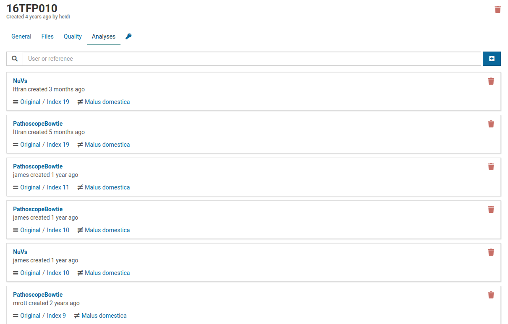
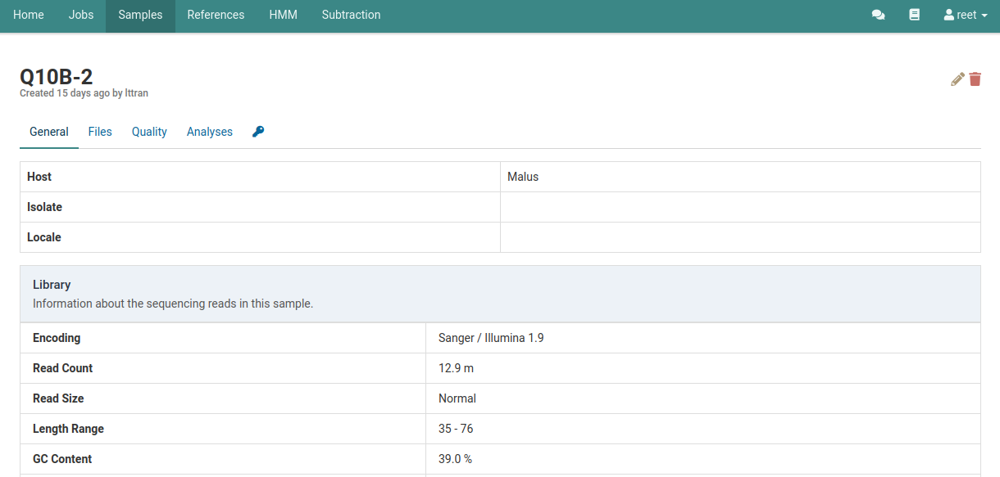
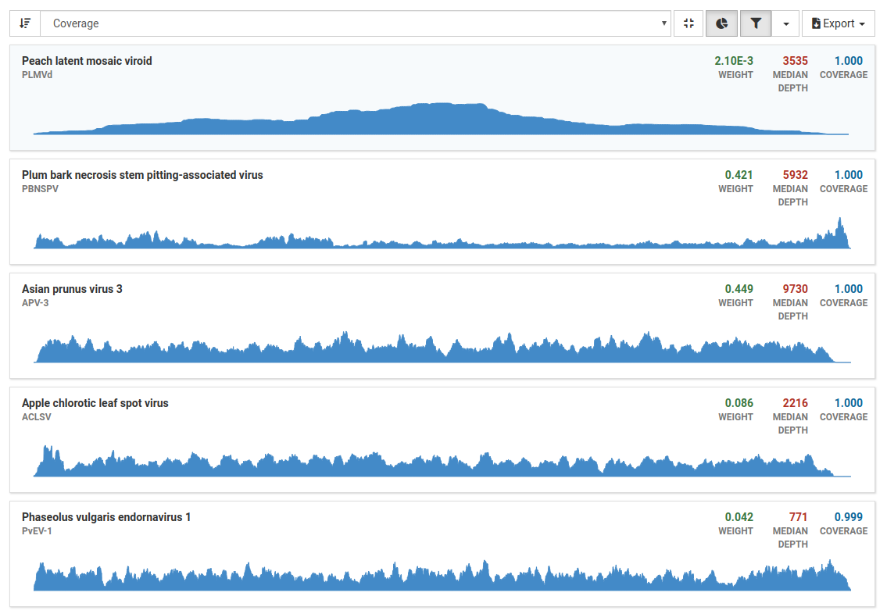
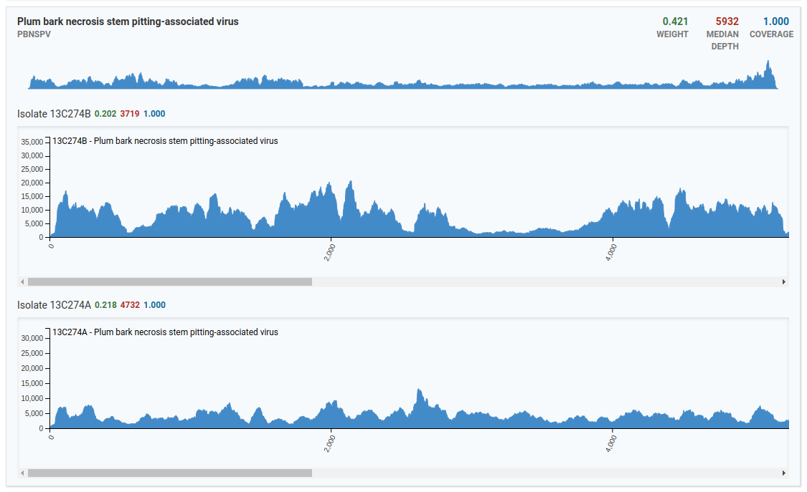
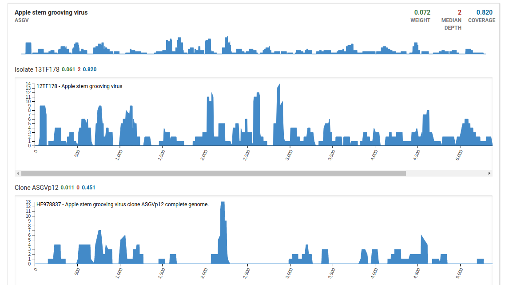

# Overview

Analyses are the results of running a bioinformatic workflow on sample data.

When an analysis is started, the sample data is run through a series of bioinformatic tools to produce a meaningful result that is made available to the user.

## Analysis Jobs

Analyzing sample data is the most computationally intensive task Virtool performs. It can take minutes or hours to run analyses for large, complex sample libraries.

Long-running analyses are therefore tracked under the **Jobs** tab.

From an analysis job, you can easily navigate to the analysis listing for the sample being analyzed.



#3 Caching

Sample data is automatically trimmed during analysis. Trimmed data are cached so that data doesn't have to be re-run.

## Reference Versions

Analyses make use of [references](/docs/manual/ug_references) composed of pathogen sequences. Since references are modifiable and versioned, analyses are linked to specific versions of a reference. If a sample needs to be analyzed against newer version, a new analysis must be created.

Here is an example of a sample with multiple analyses using different pipelines and different reference versions:

## Subtractions

Subtractions are sets of host or non-pest sequence data used to eliminiate non-pathogen reads from analysis results.

You can read more about creating and managing subtractions from the links below:

- [Subtraction Creation Tutorial](/docs/manual/tut_subtraction)
- [Subtraction User Guide](/docs/manual/ug_subtraction)

# View Analyses 

A list of analyses can be found under your sample of interest. Navigate to your sample and click the **Analyses** tab.

This page will list all the analyses that have been created or currently running on your sample. The following image shows that one analysis has been completed.

# Create an Analysis

Navigate to the analyses list for your sample of interest.

Click on the  button to open the analysis creation dialog.

Use this dialog box to choose the analysis algorithm (PathoscopeBowtie or NuVs), the subtraction, and the reference you want to use to analyze your sample. Once these fields are specified, click the  **Start** button to start the analysis.

Once the analysis is running, you can view its progress under the **Jobs** tab.

Multiple samples can be analyzed at once using the quick analysis feature. [Read more about quick analyses](/docs/manual/ug_samples).

# Delete an Analysis


**Analysis deletion is permanent**. There is no way to recover a deleted analysis.


Navigate to the analysis listing for the sample whose analysis you want to delete. Click on the  icon on an analysis record to delete it. 

The analysis record will be removed from the list.

# Interpret Pathoscope

Pathoscope is the workflow in Virtool used for determining whether a known virus is present in a sample. A number of values are used to determine the presence of a pathogen.

Under the **Analyses** tab of your sample you will see a list of analyses that have been run on your sample. Click on the analyses you would like to view. You will see an analysis page such as the one below.

Generally, approximately 5 million reads is a good base line for a dsRNA library, however the percentage of mapped reads is of greater importance. For dsRNA, percentages can range from less than 1% to greater than 80%. The greater the enrichment of viral RNA and consequently the proportion of reads mapped, the lesser total reads are required. For example, 2% of 5 million reads or 100,000 mapped reads is good.

| **Values** | **Description**                                                                                                                                                                                                    |
| ---------- | ------------------------------------------------------------------------------------------------------------------------------------------------------------------------------------------------------------------ |
| Coverage   | A measure for how well the mapped reads cover the viral genome. In general, coverage of greater than 0.5 indicates positive detection and coverage of less than 0.2 indicates negative detection.                  |
| Depth      | A measure of how many times a genome is covered by mapped reads                                                                                                                                                    |
| Weight     | The calculated proportion of reads mapping to a virus. The weight is roughly proportional to the titre. Higher the titre, higher the weight. A weight greater than 0.001 is strong indicator of positive detection |

## High Quality Positive

After running Pathoscope, the analyses tab will list all viruses Virtool thinks are likely to be in the sample. In our example, one viroid and four viruses are likely to be in the sample.

By default, pathogens with low coverage or weight (relative abundance) are filtered out. These pathogens can be made visible by clicking . 

For this example we will focus on the five pathogens that have the greatest coverage.

The section on top of the list of pathogens gives a quick overview of the total and mapped reads in the sample.

In this sample, we have over 5.3 million total reads and over 3.7 million mapped reads (69.78% mapped reads), illustrating that we have a good enrichment of viral RNA.

The values for weight, depth, and coverage are all very high therefore we can be confident that indeed these pathogens are present in the sample. 

Clicking on a pathogen will show sequencing coverage charts for the isolates that may be in your sample.

In the top example, there are three isolates for the Peach latent mosaic viroid that are present in the sample. The x-axis represents the genome size and the y-axis represents the number of reads. 

In the above image, only two isolates from the Plum bark necrosis stem pitting-associated virus are present in the sample. Notice that viruses have larger genomes than viroids therefore the x-axis runs a greater distance covering the entire distance of the virus' genome.

## High Quality Negative

The image below is an example of an analysis from a healthy sample.

The only virus that is present in the sample is Phaseolus vulgaris endornavirus 1. This virus was intentionally introduced into the nucleic acid extraction as a positive internal control to verify that the extraction succeeded.

When we filter our results we see that all other viruses have low weight, depth, and coverage, assuring us that these are not present in the sample. With these results in mind, we can confidently say that this sample is from a healthy plant.

## Low Quality

In this example, only 0.04% of reads are mapped to the total number of reads therefore it is highly unlikely that the pathogens listed are actually present in the sample. Although weight and coverage are high, no sample has a high depth value. 

Additionally when we take a look at the isolate coverage charts we see that the maximum depth is 14. This is very small compared to the maximum depth in a high quality positive sample which reaches a range in the thousands.

## Analysis of Contaminated Sample

Below is an example of an analysis from a contaminated sample.

Although we have a large number of mapped reads that cover 53.26% of the viral genome, we see that the majority of the pathogens listed are associated with grapevines. Grape viruses are usually not found in tree fruits therefore this is likely a case of contamination. 
