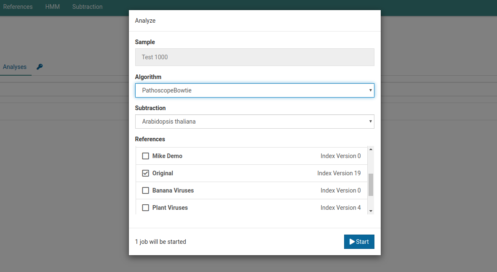

# Overview

# Analysis Jobs

Analyzing sample data is the most computationally intensive task Virtool performs. It can take minutes or hours to run analyses for large, complex sample libraries.

Long-running analyses are therefore tracked under the **Jobs** tab.

From an analysis job, you can easily navigate to the analysis listing for the sample being analyzed.



# Caching

Sample data is automatically trimmed during analysis. Trimmed data are cached so that data doesn't have to be re-run.

# What are analyses?

Analyses are the results of running a bioinformatic workflow on sample data.

When an analysis is started, the sample data is run through a series of bioinformatic tools to produce a meaningful result that is made available to the user.

# Reference Versions

Analyses make use of [references](/docs/manual/ug_references.md/) composed of pathogen sequences. Since references are modifiable and versioned, analyses are linked to specific versions of a reference. If a sample needs to be analyzed against a newer version, a new analysis must be created.

Here is an example of a sample with multiple analyses using different pipelines and different reference versions:

# Subtractions

Subtractions are sets of host or non-pest sequence data used to eliminiate non-pathogen reads from analysis results.

You can read more about creating and managing subtractions from the links below:

- [Subtraction Creation Tutorial](/docs/manual/tut_subtraction)
- [Subtraction User Guide](/docs/manual/ug_subtraction)

Virtool currently supports two built-in workflows/pipelines called PathoscopeBowtie and NuVs.

# View Analyses 

A list of analyses can be found under your sample of interest. Navigate to your sample and click the **Analyses** tab.

This page will list all the analyses that have been created or currently running on your sample. The following image shows that one analysis has been completed.

# Create an Analysis

Navigate to the analyses list for your sample of interest.

Click on the  button to open the analysis creation dialog.

Use this dialog box to choose the analysis algorithm (PathoscopeBowtie or NuVs), the subtraction, and the reference you want to use to analyze your sample. Once these fields are specified, click the  **Start** button to start the analysis.

Once the analysis is running, you can view its progress under the **Jobs** tab.

Multiple samples can be analyzed at once using the quick analysis feature. [Read more about quick analyses](/docs/manual/ug_samples).

# Delete an Analysis


**Analysis deletion is permanent**. There is no way to recover a deleted analysis.


Navigate to the analysis listing for the sample whose analysis you want to delete. Click on the  icon on an analysis record to delete it. 

The analysis record will be removed from the list.
