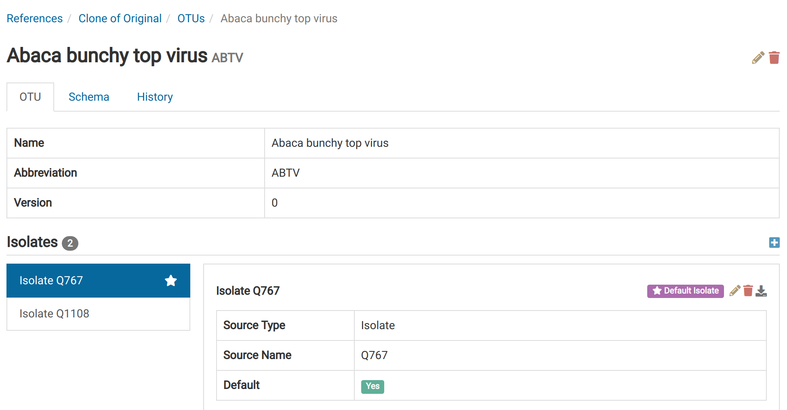

History refers to the tracked changes made to OTUs. When any aspect of an OTU is changed, a history _change_ record is created.

Changes can be considered in several different contexts. One is at the OTU-level, where the changes describe the entire life of that OTU record. Changes can also be considered as a descriptor of indexes. An index can be thought of as a collection of changes to a selection of OTUs.

Here is an example of a change being recorded when an isolate is removed from an OTU:



# View OTU Changes

The first case in which it is useful to view history data is reviewing changes to a single OTU. You can see the complete history for an OTU. Start by going to the OTU detail view.

Then click on the _History_ tab to view all changes associated with the OTU.

# View Index Changes

You can view all changes associated with an index. First navigate to the reference detail view.

Navigate to the _Indexes_ tab to list the indexes for the reference.

Select an index. The index detail page will give an overview of the changes.

View a detailed change list by clicking on _Changes_.

# Revert Changes {#revert}

You can revert any **unbuilt** changes made to an OTU. Changes included in a complete index build cannot be reverted, therefore it is a good idea to be certain of any changes before starting an index build.

Changes can be reverted by first navigating to the detail page for an OTU.

Navigate to the _History_ tab to view the history for the OTU.

The history for this OTU shows that it was cloned from another reference, then one of its isolates was removed and the other was renamed.

Click  to revert a change. Any successive changes will be removed.



Navigating back to the _OTU_ tab will show that the reversions have been reflected in the OTU.

The previously removed isolate (Q1108) is restored and the other isolate (Q767) has its previous name back.
