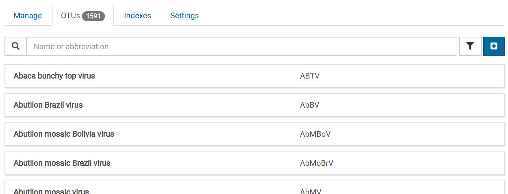

# Overview

The Virtool OTU reference is a fully editable and tracked collection of viruses, viral isolates, and their genome sequences. The data in the virus reference is used to identify potential viral infections in Illumina libraries derived from your samples.

# Concepts {#concepts}

An OTU (organization taxonomic unit) typically represents a single pathogen species. References are composed of a set of related OTUs.

An OTU must contain one or more isolates and each isolate must have one or more sequences attached to it. Sequences can

Here is the structure of a single viral OTU containing one isolate and its sequences:

```
- OTU | Apple Mosaic Virus
    - Isolate | Isolate 1
      - Sequence 1 | NC_003464
      - Sequence 2 | NC_003465
      - Sequence 3 | NC_003480
```

# Browse OTUs {#browse}

The OTUs that belong to a Virtool reference can be easily browsed and edited. To start browsing member OTUs for a given reference:

1. Navigate to the references list by navigating to _References_ in the main navigation bar.
   

2. Navigate to a reference by clicking on it. We will look at _Banana Viruses_ here.
   

3. Navigate to the OTUs tab to view the OTUs that belong to the reference.
   

4. Click on an OTU item to view its detail page.
   

In the virus database browser, you can:

- find viruses by their names or abbreviations using the search bar
- view only viruses modified since the last [index build](/viruses/indexes.md)

# Create an OTU {#create}

Creating a new OTU for a given reference requires only a name. You can optionally provide an abbreviation like those commonly used for viruses.

1. Start by clicking <i class="fas fa-plus-square"></i> under the OTUs tab to bring up a dialog for creating OTUs.
   

2. The OTU creation dialog will appear. Enter a name and abbreviation for the new virus.
   

3. Save the new OTU. It should now appear in list of the OTUs for this reference.
   

4. Navigate to the newly created OTU by clicking on it. Notice that there is a warning indicating that the OTU is not ready for primetime.
   

# Edit an OTU {#edit}

The name or abbreviation for an OTU can be created after its creation.

1. Navigate to the detail view for the OTU you want to edit.
   

2. Click on the yellow pencil icon in the top-left of the view to show the edit dialog. **Note that you will not see this icon if you don't have modification rights on the parent reference**.
   

3. Change any of the fields an click save. Will will change the abbreviation in this example.
   

# Remove an OTU {#remove}

# Add an Isolate {#add_isolate}

Isolates are how sequence data are organized within the virus record. To maintain continuity with virus sequence records in Genbank, isolates in Virtool are identified by a **source type** and **source name**. These two fields are concatenated to form the isolate's name.

Examples of source types are: _isolate_, _genotype_, and _culture_.

Examples of source names are: _A_, _Canada_, _8801-VLH_, or anything really.

1. Click on the virus entry.
   

2. Take note of the red notification at the top of the page. This indicates that the virus cannot be used in analyses until the listed issues are corrected.

3. Click <i class="vtfont i-new-entry"></i> near the **Isolates** heading to bring up a dialog for creating isolates.
   

4. Notice that the **Isolate Name** field changes with the other two fields. This will be the display name for the isolate.

5. Save the changes. The new isolate appear in the isolate editor.
   
6. You can edit or remove the isolate by clicking <i class="vtfont i-pencil"></i> and <i class="vtfont i-remove"></i>.

Open the dialog for adding an isolate by clicking the <i class="vtfont i-new-entry"></i> icon in the rights corner of the _Isolates_ header:


Fill the _Source Type_ and _Source Name_ fields. These fields are combined to create an isolate name. They are


- both fields are optional and the isolate named will be **Unamed** if they are both empty
- in a single virus, multiple isolates can have the same name
- administrators can add new source types to the

# Edit an Isolate {#edit_isolate}

# Remove an Isolate {#remove_isolate}

# Add a Sequence {#add_sequence}

Sequences are members of isolates. Many isolates will only have one sequence. If the virus in question is multipartite, more than one sequence would be assigned to each isolate.

1. Click <i class="vtfont i-new-entry"></i> near the **Sequences** heading to bring up a dialog for creating sequences.
   

2. Fill out the form fields. The **Host** field is optional. You can pull sequence records from GenBank by entering a valid GenBank accession in the **Accession** field and clicking <i class="vtfont i-wand"></i>.
   

3. Save the new virus. It will appear in the isolate editor.
   
4. Click on the sequence entry to expand it and view all the data associated with the sequence record.

# Fetch a Genbank Sequence

# Edit a Sequence

# Remove a sequence

# Schemas

# Validation

# History

Each change causes the virus's version to increase by one and is recorded with a timestamp and the user's name.

[See more information about history](/docs/manual/ug_history).
