# Overview

Selecting **Samples** on the top menu brings up the main sample managment view. Here, samples can be created, viewed, edited, analyzed, and removed.

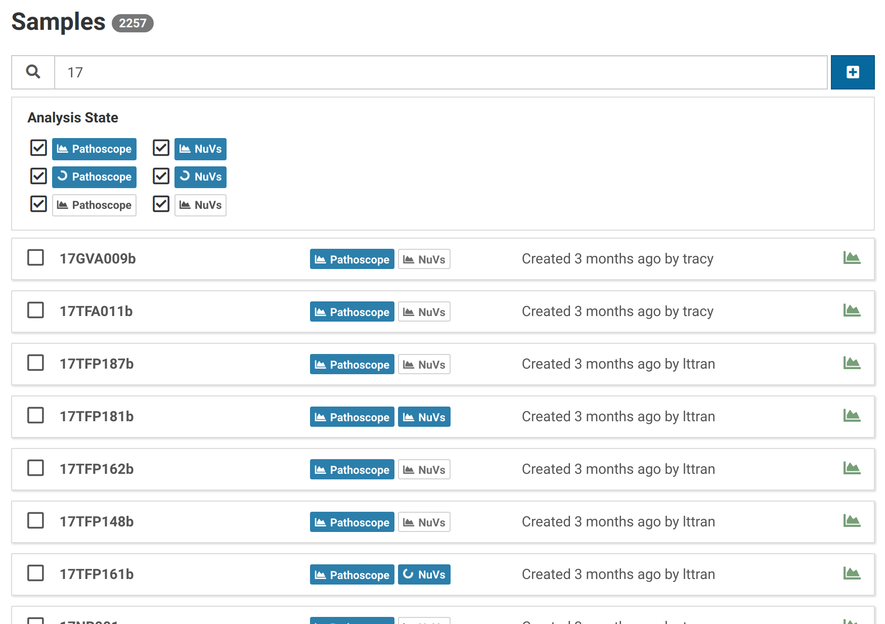

# Caching

Caching is the process of storing data in a cache (a temporary storage area). The purpose of cache memory is to store program instructions and data that are used repeatedly in the operation of programs or information that the CPU is likely to need next. 

Sample data is automatically trimmed during analysis. Trimmed data are cached so that data doesn't have to be re-run.

For example, when a new sample is run using a subtraction that has already been used, the host genome that has already been analyzed and eliminated will not have to go through the same process again. Instead the reads belonging to the host genome or non-pathogenic organisms associated with the host such as insects or fungi will already be cached. This makes the analyzing process for a sample(s) happen a lot faster and decreases the amount of work the server has to perform.

# Browse Samples

Once you have imported one or more samples, they can be browsed in the main sample managment view.

## Searching

Using the search bar, samples can be filtered by their names or the name of the user that originally imported the sample.



It is also possible to search for samples based on the their analysis state.

For each workflow (Pathoscope, NuVs), the sample can have:

  - no analysis available
  - analysis in progress
  - at least one completed analysis
  
Set the checkboxes to match the profile of samples you are looking for.

Here is an example looking for samples matching the text query _14SP_ that have **no pathoscope analysis**.

Clicking on a sample item will navigate to a detailed description of the sample.

# Upload a FASTQ File

To upload a FASTQ file, click on **Samples** in the top navigaiton bar.

On the left sidebar click **Files**. 

Click on the  **Upload** button to choose a file from your computer. Here we will choose the **large.fq** file.
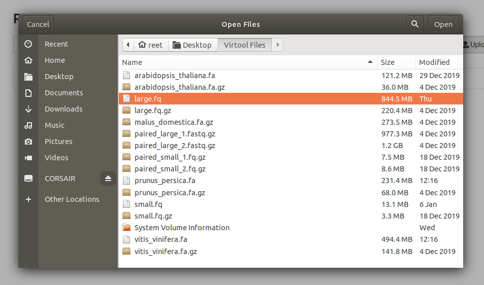

The uploaded file will then be visible under the **Read Files** overview page.

# Paired and Unpaired FASTQ Data

Paired or unpaired FASTQ data can be used to create a sample.

Samples created from only one file are assumed to be unpaired. Paired samples must comprise two paired FASTQ files. **Interleaved FASTQ files are not currently supported**.

For paired data, make sure the file orientation labels (left and right) are correct before you create a sample. You can use the  button to swap orientations.



# Create a Sample

Upload your sample FASTQ files under **Samples | Files** if you haven't yet.

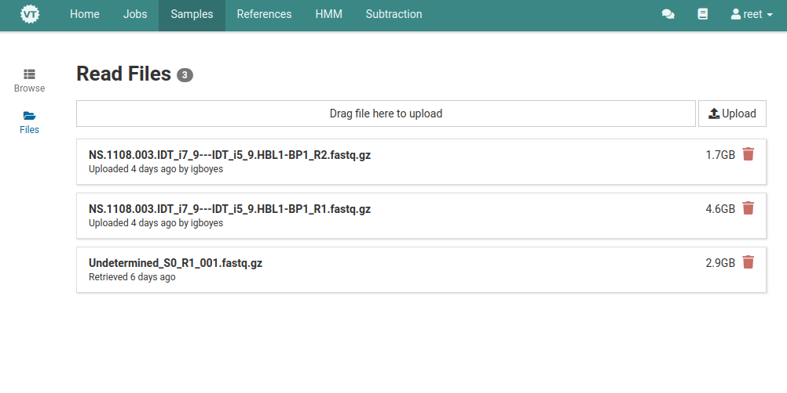

Click on the  button in the samples view to open the sample creation dialog.

The sample dialog will look something like this:

The sample creation dialog allows you to set optional metadata including _isolate_, _locale_, and _true host_.

You **must** set a unique sample _name_ and _read size_. _Read size_ can be set to either _normal_ or _sRNA_. Subsequent analysis workflows will run using significantly different parameters based on the _read size_ setting.

An appropriate _subtraction host_ must be selected. This should be the [subtraction genome](/docs/manual/ug_subtraction) most closely related to the _true host_ for your sample.

Here is an example using normal sequencing and _Banana_ as a subtraction host:

Once required fields are populated and you have selected the files, click the  **Save** button to create the sample. Your sample will immediately be listed in the samples list. However, it will take some time for the sample data to be imported and processed.

A job will appear in the **Jobs** view to track the process of creating your sample.

Your sample will look something like this when it is ready to use:

## What happens during sample creation?

Sample FASTQ files are copied into a new sample directory. The files will be compressed if necessary.

Quality information is calculated from the library using [FastQC](https://www.bioinformatics.babraham.ac.uk/projects/fastqc/) and committed to Virtool's database.

The FASTQ files and quality data are used for further analyses triggered by the user.

## Default Subtraction

The default subtraction for a sample that will be used when creating an analysis can be found on the bottom of the detailed view of that sample.
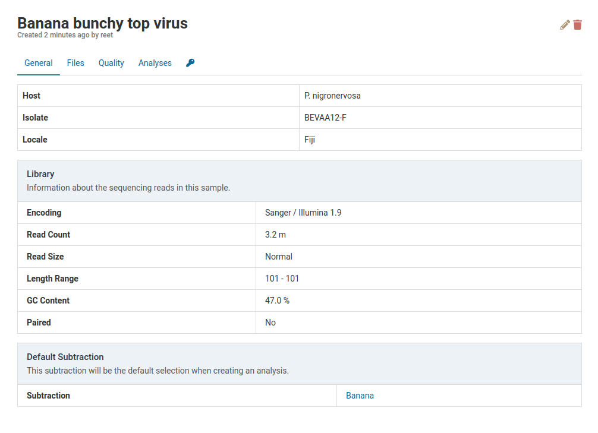

For the Banana bunchy top virus shown above, the default subtraction is **Banana**. This was the same subtraction that was selected when first creating this sample. Once a default subtraction has been made for a sample, you cannot change it. If you would like your sample to have a different default subtraction, you will have to create another sample with the new subtraction.

Additionally, when you do a quick analysis on a sample, the default subtraction will already be pre-selected. 
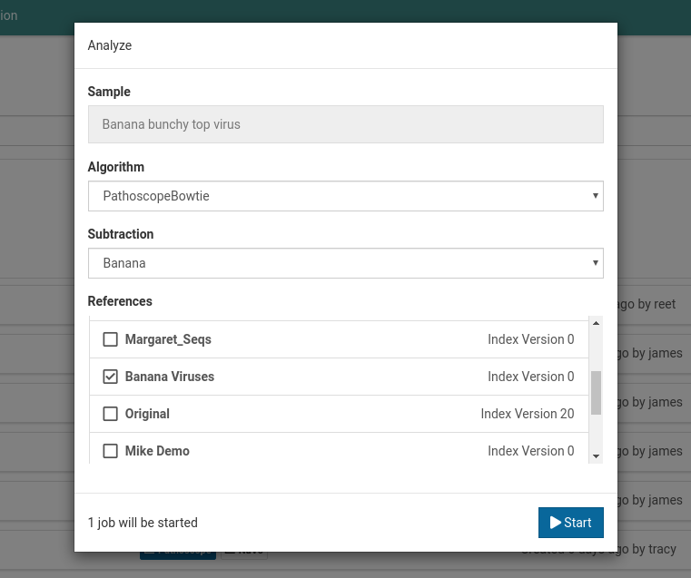

# Quick Analyze

Quick analyses allows you to start analysis jobs for multiple samples at once. Select the samples of interest and click on the  button. An **Analyze** dialog box will appear.

In this dialog you can choose the analysis algorithm (PathoscopeBowtie or NuVs), the subtraction, and the reference(s) you want to use to analyze your sample(s). Selecting multiple references will start a separate job for each sample-reference combination. Once these fields are specified, click the  **Start** button to start the analysis.
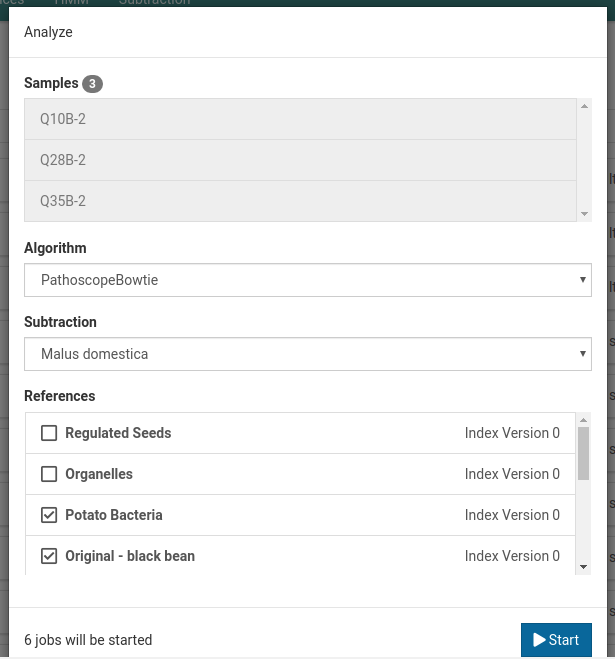

Once the analysis is running, you can view its progress under the **Jobs** tab.

# Edit a Samples

Click on **Samples** in the top navigation bar to see a list of available samples.
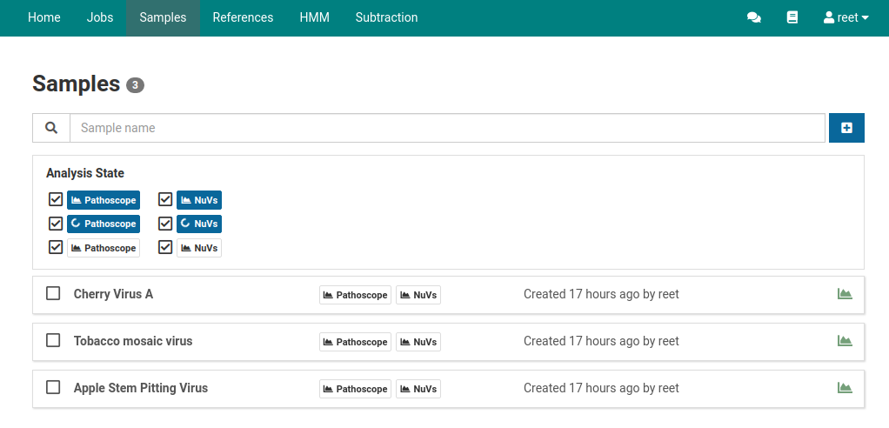

Click on the sample you would like to edit. Here we will choose **Apple Stem Pitting Virus**.
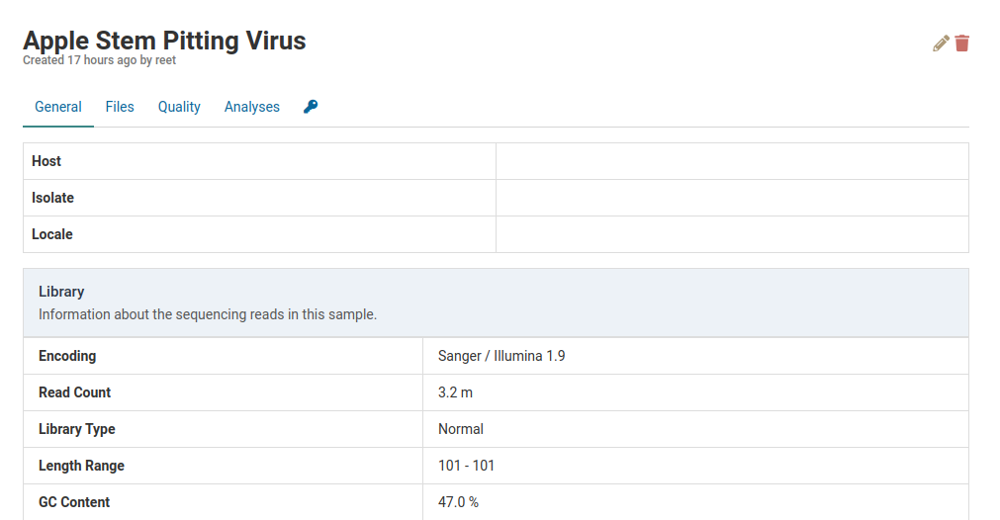

On the top right beside the name of the sample, click  to edit the sample. A dialog box like the one below will show up.
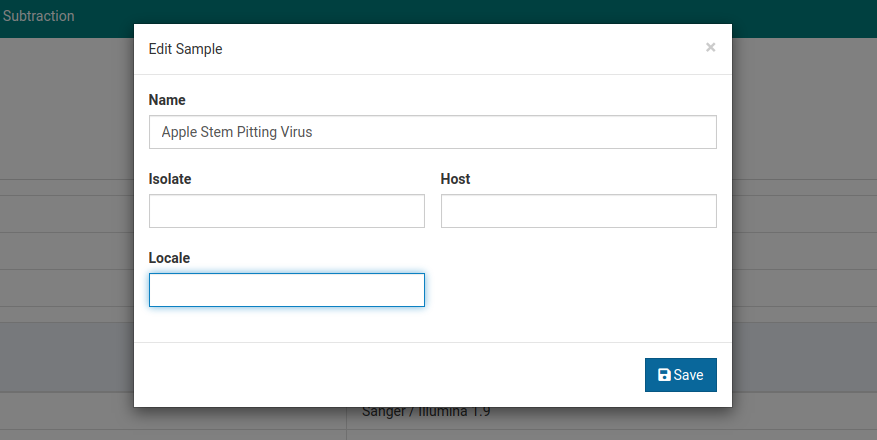

The name, isolate, host, and locale can all be edited here. After making the changes click  **Save**.

These edits will then be displayed on the sample detail view page as shown below.

# Delete a Sample

Click on **Samples** in the top navigation bar to see a list of available samples.
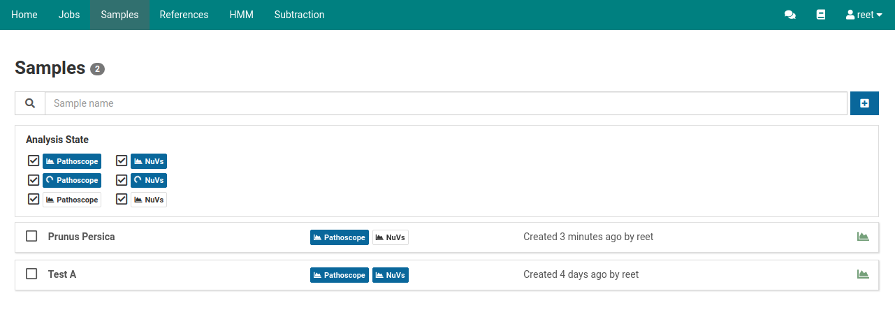

Click on the sample you wish to delete. Here we will delete **Test A**.

Click on the  to delete the sample. A dialog box such as the one below will show up to confirm the deletion of the sample. 

Click  **Confirm**. The sample will now be removed from the samples list.

# Quality

# Sample Quality

The quaity assessment of a sample is generated using FASTQC and can be visualized under the **Quality** tab.
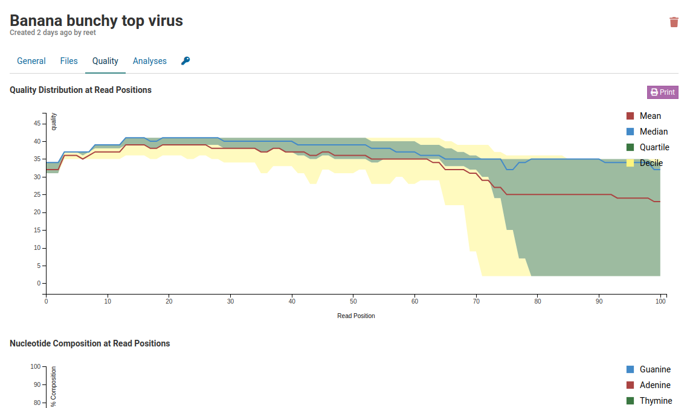

You will see three different graphs on this page as shown below.

## Quality Distribution at Read Positions

This graph shows the quality of your sample library. The Y-axis shows the quality score, the higher the better. The quality tends to decrease as the run progresses. 

Median values of less than 25 or a lower quartile of less than 10 is concerning. In the case of the sample above, the quality of our sample library is fine and further analysis can take place.

## Nucleotide Composition at Read Positions

This plot shows the proportion of each base's position in a file. In general, one should expect A/T to be roughly equal and G/C to be roughly equal. Viruses genomes are often unevenly distributed in composition and are usually A/T rich. 

With all of the things being equal in a diverse library, you should see an even distribution of the four bases which doesn't change with base position. Although the relative amount of G/C content will be determined by your library, but what you should see on the graph are parallel lines going across the plot.

## Read-wise Quality Occurrence

In this case we are taking every sequence and looking at the mean score across all the bases in that particular sequence. The distribution of those means are then plotted as shown above. All sequences should form one tight distribution (sharp curve) with universally high quality and no sequences of low quality. This sharp curve is the average quality per read. A mean quality below 27 is a cause for concern.

# Cache Quality Analysis

Cache quality analysis is determined by running Pathoscope and/or NuVs on your sample of interest. These analyses can be found under the **Analyses** tab.

Click on the **PathoscopeBowtie** to view its analyses.
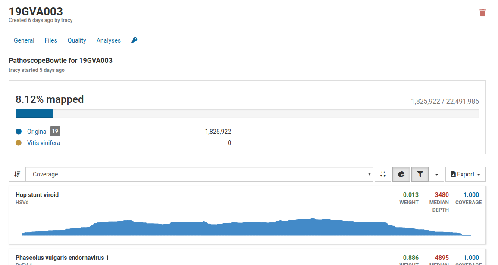

Pathoscope is the primary tool in Virtool used for determining whether a known virus is present in a sample. A number of statistics are used to determine the presence of a pathogen.

Generally, approximately 5 million reads is a good base line for a dsRNA library, however the percentage of mapped reads is of greater importance. For dsRNA, percentages can range from less than 1% to greater than 80%. The greater the enrichment of viral RNA (i.e. the higher the percent of mapped reads) the less number of total reads are required. For example, 2% of 5 million reads or 100 000 mapped reads is good.

Additional statistics include:

**Coverage:** a measure for how well the mapped reads cover the viral genome. In general, coverage of greater than 0.5 indicates positve detection and coverage less than 0.2 indicates negative detection.

**Depth:** a measure of how many times a genome is covered by mapped reads.

**Weight:** the calculated proportion of reads mapping to a virus. The weight is roughly proportional to the titre. Higher the titre, higher the weight. A weight greater than 0.001 is a strong indicator of positive detection.

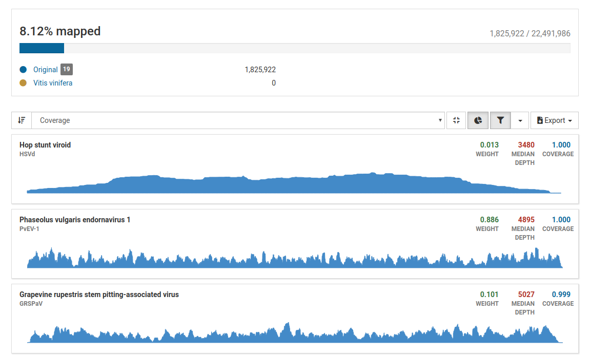

In the analyses shown above, three pathogens are likely to be in the sample. Although the total number of mapped reads is less than 5 million, the percentage of mapped reads is 8.12% therefore this is a good indicator of enrichment of viral RNA. Additionally, all three pathogens have high weight, depth, and coverage values, therefore we can confidently say that indeed these pathogens are present in the sample.

The results from Pathoscope were successful in identifying the pathogens present in the sample, therefore further analysis using NuVs is not necessary. An indication that would result in using NuVs would be if our results showed high weight and depth values in combination with low coverage values. This would indicate that the virus sequence in the sample may be significantly different than what is in the database. This may represent a new genotype or possibly a new, closely related virus.

# Rights

## Concepts

Virtool allows for fine control of the rights users have to view or modify samples.

### Management Levels

Rights can apply at four different levels.

|                  |                                                                                                                                                                    |
| ---------------- | ------------------------------------------------------------------------------------------------------------------------------------------------------------------ |
| _administrators_ |  Members of the special administrator group. These users have full read and write access to all samples as well as the ability to manage the rights on any sample. |
| _owner_          | The original sample creator. This user always has full read and write access to the sample as well as the ability to manage the rights on the sample.              |
| _group_          | The group that owns the sample. Read and write privileges can be independently set at this level.                                                                  |
| _all users_      | All users registered on the Virtool instance. Read and write privileges can be independently set at this level.                                                    |

### Group Ownership

Each sample can be owned by a specific user group. This allows multiple groups of diagnosticians or researchers to keep their data private or safe from one another while sharing a single Virtool instance.

Samples are not required to have an owner group. The group can be set to `None`. In this case, group rights settings will have no effect.

### Privileges

<table class="defs">
<tbody>

  The management level (_eg_. group, all users) cannot read or write the sample. included users will never see the sample in the sample management interface.  

  This privilege is useful for completely isolating samples between separate groups of users.



The management level (_eg_. group, all users) can only read the sample. The included users will see the sample in the sample management interface and be able to view its general information, quality, and analyses.

They will not be able to edit or remove the sample and they will not be able to create new analyses. The elements in the user interface associated with the described actions will be hidden.



The management level (_eg_. group, all users) can only read the sample. The included users will see the sample in the sample management interface and be able to view its general information, quality, and analyses.

They will also be able to edit and remove the sample and create new analyses.

</tbody>
</table>

## Management

The access rights for an existing sample can be easily changed by the sample owner or an administrator.

Access the rights management controls by clicking the  tab in the sample detail view.

## Default Rights

Samples have their initial access rights configured when they are first created. How these rights are assigned can be configured in the adminstrative settings.

1. Go to the _Settings_ > _General_ view as an administrator.
   

# Settings {#settings}

## Unique Sample Names

By default, sample names must be unique to the sample manager. This prevents confusion with duplicately named samples. It is possible to disable this feature. To do so, click **Settings** on the left sidebar under the samples overview page.

Click  in the **Unique Sample Names** box to ensure that every created sample has a unique name.

## Default Sample Rights

These settings determine how rights are assigned to newly created samples. Sample rights in Virtool are reminiscent of UNIX permissions.

### Sample Group

This determines how an owner group is applied to the sample when it is created.

|                 |                                                                                 |
| --------------- | ------------------------------------------------------------------------------- |
| _None_          | No group owner is assigned. Group rights do not apply                           |
| _Force Choice_  | The sample creator is forced to choose the owner group from their member groups |
| _Primary Group_ | The sample is automatically assigned the creators primary group                 |

### Group Rights

This setting determines how members of the owner group can interact with the sample. If the owner group is _None_, this setting has no effect.

### Group Rights

This setting determines how members of the owner group can interact with the sample. If the owner group is _None_, this setting has no effect. Rights can be changed by sample owners and administrators at any time.

|                |                                                                                                                     |
| -------------- | ------------------------------------------------------------------------------------------------------------------- |
| _None_         | Sample is not returned in searches and is not accessible by URL.                                                    |
| _Read_         | Sample is returned in searches and is viewable. All editing interfaces are disabled and analyses cannot be started. |
| _Read & Write_ | In addition to _Read_ rights, editing interfaces are enabled and analyses can be run.                               |

### All Users' Rights

This settings determines how any Virtool user can interact with the sample. Rights for all users behave exactly as they do in **Group Rights**. Rights can be changed by sample owners and administrators at any time.
