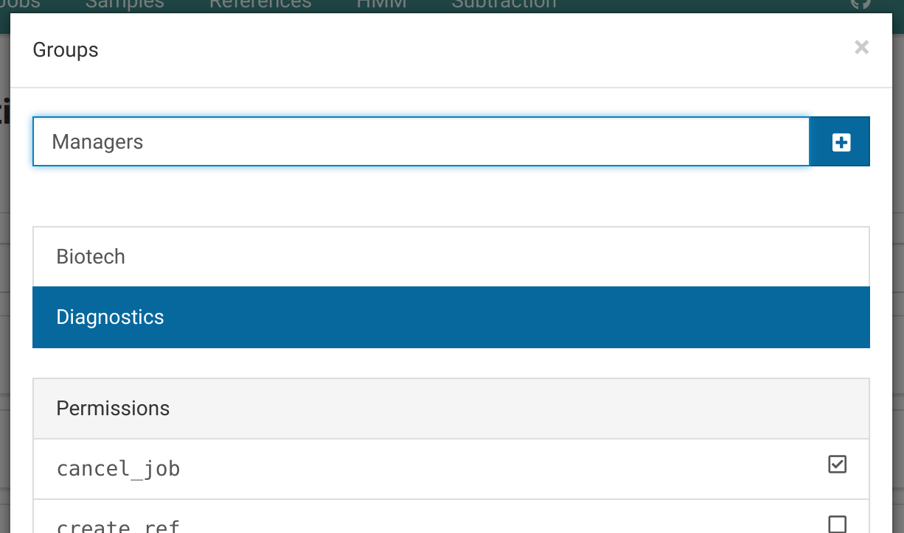
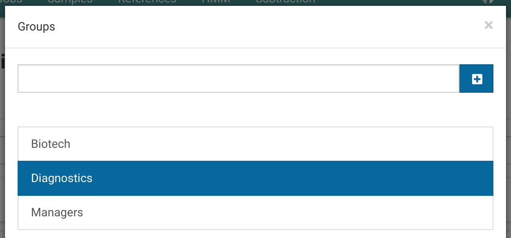

User accounts are used to control access to Virtool. They allow fine control of what actions users are allowed to perform and what resources they are allowed to access.

# Concepts

## Ownership

When users create new data items (_eg_. samples, references, jobs), they are automatically assigned as the owner of that item.

For references and samples, owners have perpetual full rights on their samples and references.

## Rights

Rights are properties of samples and references that control what actions specific users or user groups are allowed to perform on them.

Administrators automatically pass all rights checks.

## Permissions

Permissions are used to control what application-level actions users are allowed to perform. Permissions are inherited through group membership.

Administrators automatically pass all permission checks.

| Permission           | Description                                  |
| -------------------- | -------------------------------------------- |
| `cancel_job`         | can cancel running jobs                      |
| `create_ref`         | can create references                        |
| `create_sample`      | can create samples                           |
| `modify_hmm`         | can add and remove HMM annotations and files |
| `modify_subtraction` | can add, modify, and remove subtractions     |
| `remove_file`        | can remove uploaded files                    |
| `remove_job`         | can remove cancelled and finished jobs       |
| `upload_file`        | can upload files                             |

## Groups

Groups allow setting rights and permissions for more than one user. Users that are members of a group will inherit rights and permissions from the group.

It is not possible to set permissions on a per-user basis.

## Administrators

User accounts can either be administrative or limited.

Administrators automatically pass all permission and right checks. They can also access the [Administration Panel](/docs/manual/ug_administration).

# Create a User

Click the  button to open the user creation dialog.

Enter a username and password for the user. Clicking _Force user to reset password on login_ will display a password reset page for the user when they login for the first time.

Click  _Save_ to add the user. They will appear in the list of users.

# Change a User's Password

Administrators can forcefully change a users's password.

This is useful when a user forgets their password or an old user account must be accessed.

Locate the _Change Password_ panel in the _Users_ tab.

Enter a new password and click  _Save_.

The _Last changed_ time will be updated if you successfully change the password.

Clicking _Force user to reset password on login_ will invalidate all of the users existing sessions and require them to login and reset their password when they try to access Virtool.

# Change a User's Group Membership

Users' group membership can be changed easily.

This may affect what rights the user has on certain samples and references. It can also affect their application permissions.

Locate the _Groups_ panel in the _Users_ tab.

Click one of the group items to toggle membership in it.

Notice that the user's permissions are changed when group membership is toggled.



# Change a User's Primary Group

Samples that a user creates can automatically be assigned to the creating user's primary user group.

How samples are assigned their initial user group is [configurable](/docs/manual/ug_samples/#settings).

Locate the _Primary Group_ panel under the _Users_ tab.

Select a primary group for the user from the dropdown list of the user's member groups.

The display group is the user's primary group.

# Manage Groups

The group management interface can be acessed by clicking the  button to the right of the search bar in _Users_ tab.

The group management interface looks like this:

# Create a Group

Open the group management interface. Enter a name for the new group in the input at the top of dialog and click the  button.

The new group will appear in the groups list.

# Modify a Group's Permissions

Open the group management interface and select the group you want to change permissions for.

Toggle permission by clicking them.



Users added to the _managers_ group will inherit the toggled permissions.



# Remove a Group

Open the group management interface and select the group you want to remove.

Click the  _Remove Group_ button to remove the group.

